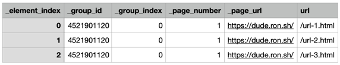

<table>
    <tr>
        <td>License</td>
        <td></td>
        <td>Version</td>
        <td></td>
    </tr>
    <tr>
        <td>Github Actions</td>
        <td></td>
        <td>Coverage</td>
        <td></td>
    </tr>
    <tr>
        <td>Supported versions</td>
        <td></td>
        <td>Wheel</td>
        <td></td>
    </tr>
    <tr>
        <td>Status</td>
        <td></td>
        <td>Downloads</td>
        <td></td>
    </tr>
</table>

# dude uncomplicated data extraction

Dude is a very simple framework for writing web scrapers using Python decorators.
The design, inspired by [Flask](https://github.com/pallets/flask), was to easily build a web scraper in just a few lines of code.
Dude has an easy-to-learn syntax.

> 🚨 Dude is currently in Pre-Alpha. Please expect breaking changes.

## Installation

To install, simply run the following from terminal.

```bash
pip install pydude
playwright install  # Install playwright binaries for Chrome, Firefox and Webkit.
```

## Minimal web scraper

The simplest web scraper will look like this:

```python
from dude import select


@select(css="a")
def get_link(element):
    return {"url": element.get_attribute("href")}
```

The example above will get all the [hyperlink](https://en.wikipedia.org/wiki/Hyperlink#HTML) elements in a page and calls the handler function `get_link()` for each element.

## How to run the scraper

You can run your scraper from terminal/shell/command-line by supplying URLs, the output filename of your choice and the paths to your python scripts to `dude scrape` command.

```bash
dude scrape --url "<url>" --output data.json path/to/script.py
```

The output in `data.json` should contain the actual URL and the metadata prepended with underscore.

```json5
[
  {
    "_page_number": 1,
    "_page_url": "https://dude.ron.sh/",
    "_group_id": 4502003824,
    "_group_index": 0,
    "_element_index": 0,
    "url": "/url-1.html"
  },
  {
    "_page_number": 1,
    "_page_url": "https://dude.ron.sh/",
    "_group_id": 4502003824,
    "_group_index": 0,
    "_element_index": 1,
    "url": "/url-2.html"
  },
  {
    "_page_number": 1,
    "_page_url": "https://dude.ron.sh/",
    "_group_id": 4502003824,
    "_group_index": 0,
    "_element_index": 2,
    "url": "/url-3.html"
  }
]
```

Changing the output to `--output data.csv` should result in the following CSV content.



## Features

- Simple [Flask](https://github.com/pallets/flask)-inspired design - build a scraper with decorators.
- Uses [Playwright](https://playwright.dev/python/) API - run your scraper in Chrome, Firefox and Webkit and leverage Playwright's powerful selector engine supporting CSS, XPath, text, regex, etc.
- Data grouping - group related results.
- URL pattern matching - run functions on specific URLs.
- Priority - reorder functions based on priority.
- Setup function - enable setup steps (clicking dialogs or login).
- Navigate function - enable navigation steps to move to other pages.
- Custom storage - option to save data to other formats or database.
- Async support - write async handlers.
- Option to use other parser backends aside from Playwright.
  - [BeautifulSoup4](https://roniemartinez.github.io/dude/advanced/09_beautifulsoup4.html) - `pip install pydude[bs4]`
  - [Parsel](https://roniemartinez.github.io/dude/advanced/10_parsel.html) - `pip install pydude[parsel]`
  - [lxml](https://roniemartinez.github.io/dude/advanced/11_lxml.html) - `pip install pydude[lxml]`
  - [Pyppeteer](https://roniemartinez.github.io/dude/advanced/12_pyppeteer.html) - `pip install pydude[pyppeteer]`
  - [Selenium](https://roniemartinez.github.io/dude/advanced/13_selenium.html) - `pip install pydude[selenium]`
- Option to follow all links indefinitely (Crawler/Spider).
- Events - attach functions to startup, pre-setup, post-setup and shutdown events.
- Option to save data on every page.

## Supported Parser Backends

By default, Dude uses Playwright but gives you an option to use parser backends that you are familiar with.
It is possible to use parser backends like 
[BeautifulSoup4](https://roniemartinez.github.io/dude/advanced/09_beautifulsoup4.html), 
[Parsel](https://roniemartinez.github.io/dude/advanced/10_parsel.html),
[lxml](https://roniemartinez.github.io/dude/advanced/11_lxml.html),
[Pyppeteer](https://roniemartinez.github.io/dude/advanced/12_pyppeteer.html), 
and [Selenium](https://roniemartinez.github.io/dude/advanced/13_selenium.html).

Here is the summary of features supported by each parser backend.

<table>
<thead>
  <tr>
    <td rowspan="2" style='text-align:center;'>Parser Backend</td>
    <td rowspan="2" style='text-align:center;'>Supports<br>Sync?</td>
    <td rowspan="2" style='text-align:center;'>Supports<br>Async?</td>
    <td colspan="4" style='text-align:center;'>Selectors</td>
    <td rowspan="2" style='text-align:center;'><a href="https://roniemartinez.github.io/dude/advanced/01_setup.html">Setup<br>Handler</a></td>
    <td rowspan="2" style='text-align:center;'><a href="https://roniemartinez.github.io/dude/advanced/02_navigate.html">Navigate<br>Handler</a></td>
  </tr>
  <tr>
    <td>CSS</td>
    <td>XPath</td>
    <td>Text</td>
    <td>Regex</td>
  </tr>
</thead>
<tbody>
  <tr>
    <td>Playwright</td>
    <td>✅</td>
    <td>✅</td>
    <td>✅</td>
    <td>✅</td>
    <td>✅</td>
    <td>✅</td>
    <td>✅</td>
    <td>✅</td>
  </tr>
  <tr>
    <td>BeautifulSoup4</td>
    <td>✅</td>
    <td>✅</td>
    <td>✅</td>
    <td>🚫</td>
    <td>🚫</td>
    <td>🚫</td>
    <td>🚫</td>
    <td>🚫</td>
  </tr>
  <tr>
    <td>Parsel</td>
    <td>✅</td>
    <td>✅</td>
    <td>✅</td>
    <td>✅</td>
    <td>✅</td>
    <td>✅</td>
    <td>🚫</td>
    <td>🚫</td>
  </tr>
  <tr>
    <td>lxml</td>
    <td>✅</td>
    <td>✅</td>
    <td>✅</td>
    <td>✅</td>
    <td>✅</td>
    <td>✅</td>
    <td>🚫</td>
    <td>🚫</td>
  </tr>
  <tr>
    <td>Pyppeteer</td>
    <td>🚫</td>
    <td>✅</td>
    <td>✅</td>
    <td>✅</td>
    <td>✅</td>
    <td>🚫</td>
    <td>✅</td>
    <td>✅</td>
  </tr>
  <tr>
    <td>Selenium</td>
    <td>✅</td>
    <td>✅</td>
    <td>✅</td>
    <td>✅</td>
    <td>✅</td>
    <td>🚫</td>
    <td>✅</td>
    <td>✅</td>
  </tr>
</tbody>
</table>

## Documentation

Read the complete documentation at [https://roniemartinez.github.io/dude/](https://roniemartinez.github.io/dude/).
All the advanced and useful features are documented there.

## Requirements

- ✅ Any dude should know how to work with selectors (CSS or XPath).
- ✅ Familiarity with any backends that you love (see [Supported Parser Backends](#supported-parser-backends))
- ✅ Python decorators... you'll live, dude!

## Why name this project "dude"?

- ✅ A [Recursive acronym](https://en.wikipedia.org/wiki/Recursive_acronym) looks nice.
- ✅ Adding "uncomplicated" (like [`ufw`](https://wiki.ubuntu.com/UncomplicatedFirewall)) into the name says it is a very simple framework. 
- ✅ Puns! I also think that if you want to do web scraping, there's probably some random dude around the corner who can make it very easy for you to start with it. 😊

## Author

[Ronie Martinez](mailto:ronmarti18@gmail.com)
