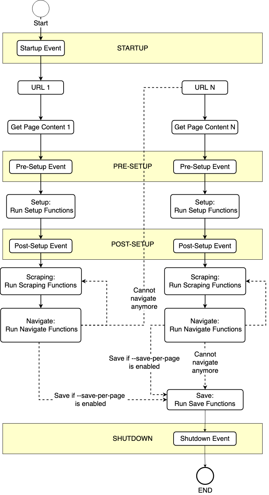

# Events

Functions can be registered to be called on specific events which makes it possible to run custom actions like setting 
up databases or calling API for authentication, and performing additional actions on page objects
(can be soup, driver, selector or tree objects) like taking screenshots.

Here is a diagram when events are being executed.



## Startup Event

The Startup event is executed at the start of the process. 

The `@startup()` decorator can be used to register a function for startup. 
This can be used to setup databases or authenticate to APIs and other possible use-cases prior to actual web scraping.

```python
from pathlib import Path

from dude import startup

SAVE_DIR: Path


@startup()
def initialize_csv():
    global SAVE_DIR
    SAVE_DIR = Path(__file__).resolve().parent / "temp"
    SAVE_DIR.mkdir(exist_ok=True)
```

## Pre-Setup Event

The Pre-Setup event is executed after loading a page or getting an HTTP response.

The `@pre_setup()` decorator can be used to register a function for pre-setup. 
Note that the function should accept one argument which can either be a page, driver, soup, Parsel selector or LXML tree.

```python
import uuid
from dude import pre_setup

...

@pre_setup()
def screenshot(page):
    unique_name = str(uuid.uuid4())
    page.screenshot(path=SAVE_DIR / f"{unique_name}.png")
```

## Post-Setup Event

The Post-Setup event is executed after running the [setup functions](https://roniemartinez.github.io/dude/advanced/01_setup.html).

The `@post_setup()` decorator can be used to register a function for post-setup. 
Note that the function should accept one argument which can either be a page, driver, soup, Parsel selector or LXML tree.

```python
import uuid
from dude import post_setup

...

@post_setup()
def print_pdf(page):
    unique_name = str(uuid.uuid4())
    page.pdf(path=SAVE_DIR / f"{unique_name}.pdf")
```
